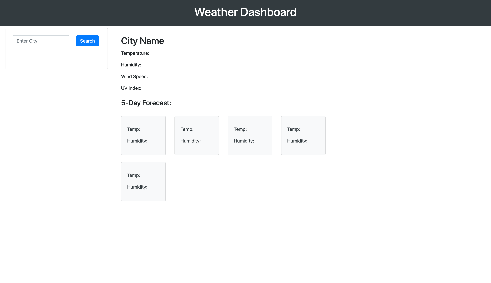
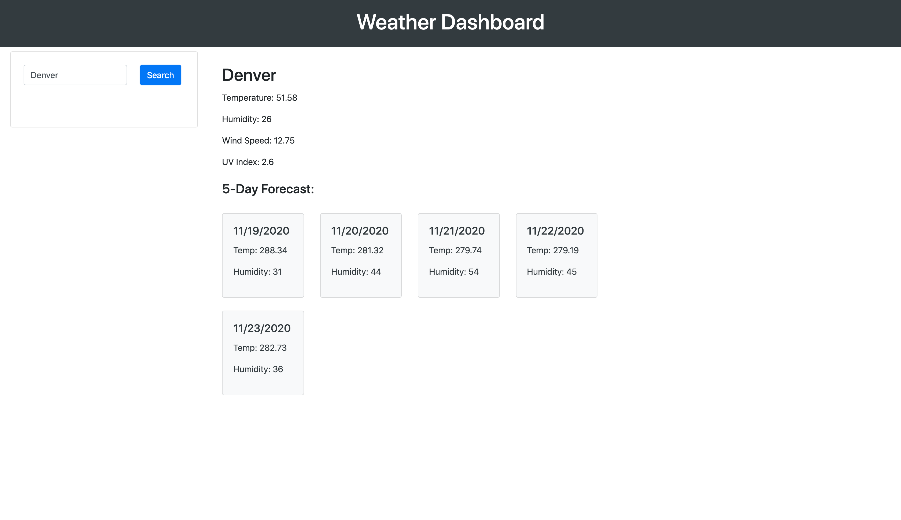

## Server-Side-APIs-Weather-Dashboard

This project displays a weather dashboard that runs in the browser and features dynamically updated HTML and CSS. The OpenWeather API is utilized to access data with specific parameters to showcase current and forecasted weather based on city input from the user.

## Requirements

GIVEN a weather dashboard with form inputs \
WHEN I search for a city \
THEN I am presented with current and future conditions for that city and that city is added to the search history \
WHEN I view current weather conditions for that city \
THEN I am presented with the city name, the date, an icon representation of weather conditions, the temperature, the humidity, the wind speed, and the UV index \
WHEN I view the UV index \
THEN I am presented with a color that indicates whether the conditions are favorable, moderate, or severe \
WHEN I view future weather conditions for that city \
THEN I am presented with a 5-day forecast that displays the date, an icon representation of weather conditions, the temperature, and the humidity \
WHEN I click on a city in the search history \
THEN I am again presented with current and future conditions for that city

## Links

* [Weather Dashboard](https://smithrkorey.github.io/Server-Side-APIs-Weather-Dashboard/)
* [Github Repository](https://github.com/smithrkorey/Server-Side-APIs-Weather-Dashboard)

## Mock Up

The following images shows the finished site:

## Contributing Technologies

* [jQuery](https://jquery.com/)
* [Bootstrap](https://getbootstrap.com/)
* [OpenWeather API](https://openweathermap.org/api)